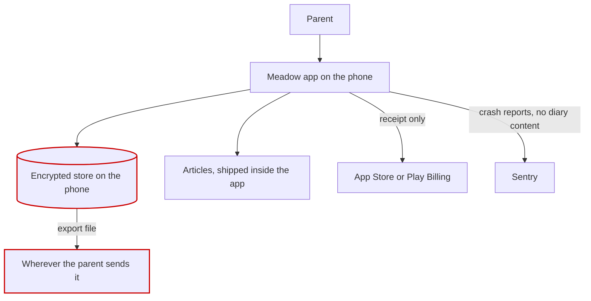

# Meadow: architecture

Example only, from an invented project.

Everything runs on the phone. There is no server holding user data, and the only
copy of a parent's diary is the encrypted store on their device.

The red boxes hold personal data. Nothing else does.

## Does data leave the device

Only in three ways. The parent exports a file and sends it somewhere themselves.
A purchase receipt goes to the store, and it holds no diary content. A crash
report goes to Sentry, with the stack trace scrubbed of any field value.

## What happens when the network is gone

Everything except buying a subscription works. Articles ship inside the app, so
reading works on a plane. A purchase started offline fails with a message and
does not charge anybody.

## Where is the only copy of anything

The encrypted store. A parent who loses the phone loses the diary, unless they
exported it. The app says so during onboarding and in settings.

## Which parts are optional

Sentry can be turned off in settings and the app works without it. Articles are
optional in the sense that the diary works with an empty content file, which is
what the tests use.

Written by an agent on 2026-08-14. Nobody has reviewed it.
