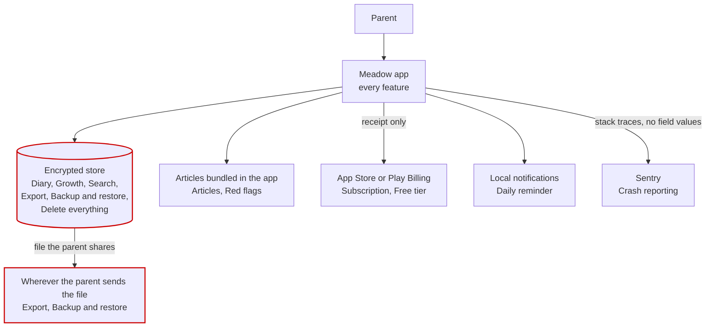

# Meadow: architecture

> What runs where, what talks to what, and which parts hold personal data.

Example only, from an invented project.

Everything runs on the phone. There is no server holding user data, and the only
copy of a parent's diary is the encrypted store on their device.

Each box says which features from the spec it serves, so you can see where a
feature lives and what stops working when one box fails.

The red boxes hold personal data. Nothing else does.

Every feature in the spec appears on at least one box, and every box serves at
least one feature. A box serving none would be either dead code or a feature
nobody wrote down.

## Does data leave the device

Only in three ways. The parent exports a file and sends it somewhere themselves.
A purchase receipt goes to the store, and it holds no diary content. A crash
report goes to Sentry, with the stack trace scrubbed of any field value.

## What happens when the network is gone

Everything except Subscription works. Articles ship inside the app, so reading
works on a plane. Backup and restore never needed a network. A purchase started
offline fails with a message and does not charge anybody.

## Where is the only copy of anything

The encrypted store. A parent who loses the phone loses the diary, unless they
used Export or Backup and restore. The app says so during onboarding and in
settings.

## Which parts are optional

Sentry can be turned off in settings and the app works without it. The bundled
articles are optional in the sense that the diary works with an empty content
file, which is what the tests use.

Written by an agent on 2026-08-14. Nobody has reviewed it.
